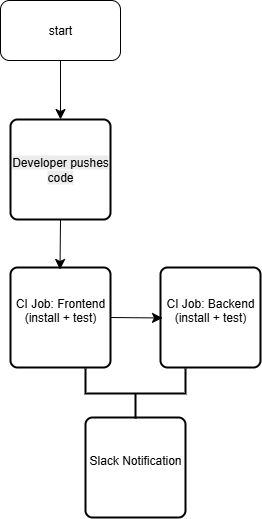

# Week 5 – CI/CD with GitHub Actions

This repository contains the **Summary Task** for Week 5 of the DevOps course.  
The goal was to design and implement a **CI/CD pipeline** using GitHub Actions, integrating both a **frontend** and **backend** project.

---

## 📂 Repository Structure

---

## ⚙️ CI/CD Pipeline

The pipeline runs on **push** and **pull_request** events.  
It includes:
- ✅ **Matrix builds** (Node.js versions 14, 16, 18)  
- 🔨 **Frontend & Backend jobs** (install + test)  
- 📦 **Artifact uploads** for both projects  
- 🔔 **Slack notifications** on success/failure  

---

## 🖼️ Pipeline Flowchart

---

## 📝 Reflection
See [REFLECTION.md](REFLECTION.md) for answers to the reflection questions.

